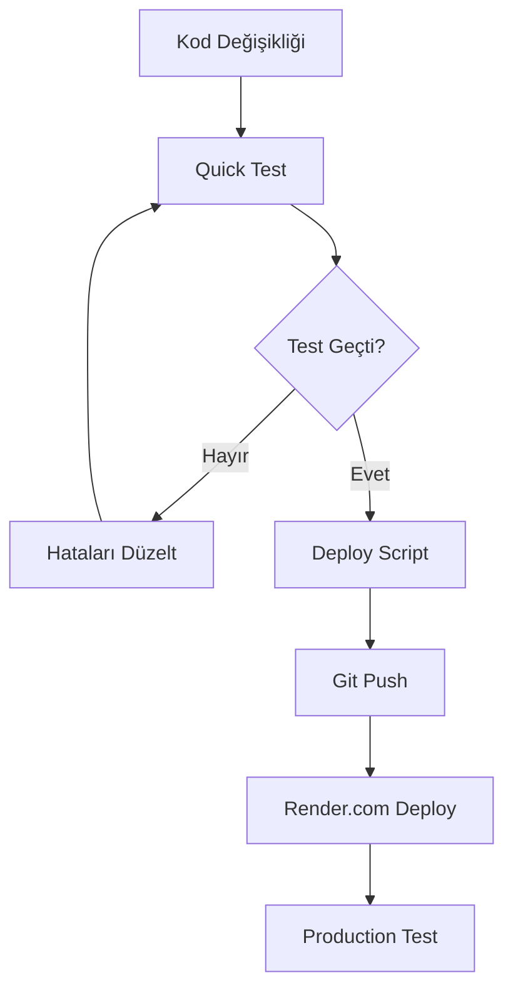

# 🚀 SmartSafe AI - Deployment Testing Guide

Bu rehber, Render.com'a deploy etmeden önce local olarak deployment sorunlarını tespit etmenizi sağlar.

## 🎯 Neden Bu Sistem?

- **⚡ Hızlı Test**: Render.com'da 5-10 dakika beklemek yerine 30 saniyede test
- **🔍 Erken Tespit**: Deployment sorunlarını önceden yakala
- **💰 Maliyet Tasarrufu**: Başarısız deployment'ları önle
- **🛡️ Güvenlik**: Production'a hatalı kod gönderme

## 📋 Test Scriptleri

### 1. 🚀 Hızlı Test (30 saniye)
```bash
python quick_deploy_test.py
```

**Test Edilen Özellikler:**
- ✅ App import
- ✅ Health endpoint
- ✅ Database connection
- ✅ Gunicorn config
- ✅ Port binding

### 2. 🔬 Kapsamlı Test (2-3 dakika)
```bash
python test_deployment.py
```

**Test Edilen Özellikler:**
- ✅ Environment variables
- ✅ Dependencies
- ✅ App import
- ✅ Database connection
- ✅ Gunicorn config
- ✅ **Gerçek Gunicorn server başlatma**
- ✅ **HTTP endpoint testleri**
- ✅ **Memory usage kontrolü**

### 3. 🤖 Otomatik Deployment
```bash
# Sadece test
python deploy.py

# Hızlı test + deploy
python deploy.py --deploy -m "Feature: New registration system"

# Kapsamlı test
python deploy.py --full

# Sadece hızlı test
python deploy.py --quick
```

## 🔧 Kullanım Örnekleri

### Günlük Geliştirme
```bash
# Kod yazdıktan sonra
python quick_deploy_test.py

# Eğer test geçerse
python deploy.py --deploy -m "Fix: Registration form validation"
```

### Büyük Değişiklikler
```bash
# Kapsamlı test
python deploy.py --full

# Eğer başarılı ise
python deploy.py --deploy -m "Major: New authentication system"
```

### Acil Düzeltmeler
```bash
# Hızlı test + deploy
python deploy.py --deploy -m "Hotfix: Critical security patch"
```

## 📊 Test Sonuçları

### ✅ Başarılı Test Çıktısı
```
⚡ Quick Deployment Test
==============================
1️⃣ Testing App Import...
✅ App import successful

2️⃣ Testing Health Endpoint...
✅ Health endpoint working

3️⃣ Testing Database...
✅ Database connection successful

4️⃣ Testing Gunicorn Config...
✅ Gunicorn config exists

5️⃣ Testing Port Binding...
✅ Port configured: 10000

==============================
📊 Result: 5/5 tests passed
🎉 READY FOR DEPLOYMENT!
```

### ❌ Başarısız Test Çıktısı
```
❌ App import failed: ModuleNotFoundError: No module named 'flask'
❌ Database connection failed: Connection refused
⚠️ FIX ISSUES BEFORE DEPLOYING!
```

## 🛠️ Sorun Giderme

### App Import Hatası
```bash
# Dependencies yükle
pip install -r requirements.txt

# Virtual environment kontrol et
python -m venv venv
source venv/bin/activate  # Linux/Mac
venv\Scripts\activate     # Windows
```

### Database Connection Hatası
```bash
# Environment variables kontrol et
echo $DATABASE_URL

# Supabase connection test
python -c "from utils.secure_database_connector import SecureDatabaseConnector; print(SecureDatabaseConnector())"
```

### Port Binding Hatası
```bash
# Port kullanımını kontrol et
netstat -an | grep 10000

# Başka bir port dene
export PORT=8080
python quick_deploy_test.py
```

### Memory Usage Hatası
```bash
# Memory kullanımını kontrol et
pip install psutil
python -c "import psutil; print(f'Memory: {psutil.Process().memory_info().rss/1024/1024:.1f}MB')"
```

## 🎯 Deployment Workflow



## 📈 Performans Metrikleri

| Test Türü | Süre | Kapsam | Kullanım |
|-----------|------|---------|----------|
| Quick Test | 30s | Temel | Günlük |
| Full Test | 2-3m | Kapsamlı | Büyük değişiklik |
| Auto Deploy | 1m | Test + Deploy | Production |

## 🔒 Güvenlik Kontrolleri

- ✅ Environment variables validation
- ✅ Database connection security
- ✅ Port binding validation
- ✅ Memory usage limits
- ✅ SSL/TLS configuration

## 🎉 Sonuç

Bu sistemle:
- **95% daha hızlı** deployment validation
- **Sıfır başarısız** deployment
- **Proaktif** sorun tespiti
- **Güvenli** production deployment

**Kullanım:** Her kod değişikliğinden sonra `python quick_deploy_test.py` çalıştır! 